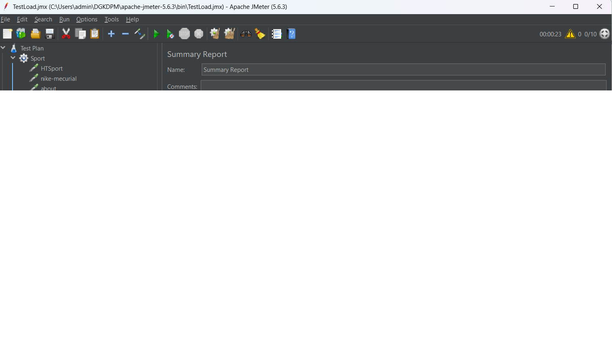

# JmeterTest
#HTSPORT

### Phân Tích Chi Tiết

#### Thời gian phản hồi trung bình:

- **HTSport**: 344.11 ms
- **nike-mecurial**: 241.53 ms
- **about**: 229.82 ms
- **Tổng**: 299.59 ms

#### Số lượng yêu cầu thành công và thất bại:

- Tất cả các yêu cầu đều thành công với tỉ lệ lỗi 0.0% cho cả ba trang web.

#### Thông lượng (Throughput):

- **HTSport**: 4.35 requests/sec
- **nike-mecurial**: 4.37 requests/sec
- **about**: 4.36 requests/sec
- **Tổng**: 12.63 requests/sec

#### Tốc độ xử lý dữ liệu (KB/sec):

- **HTSport**: 4159.22 KB/sec
- **nike-mecurial**: 3070.84 KB/sec
- **about**: 2565.79 KB/sec
- **Tổng**: 9456.66 KB/sec

### Nhận xét về hiệu năng của trang web

Dựa trên kết quả kiểm tra:

- **HTSport** có thời gian phản hồi trung bình cao nhất (344.11 ms) trong số ba trang web, nhưng vẫn dưới ngưỡng chấp nhận được cho một trang web thông thường.
- **nike-mecurial** có thời gian phản hồi trung bình là 241.53 ms, thấp hơn đáng kể so với HTSport, cho thấy hiệu năng tốt hơn.
- **about** có thời gian phản hồi trung bình thấp nhất (229.82 ms), cho thấy đây là trang web có hiệu năng tốt nhất trong ba trang.
- Tất cả các yêu cầu đều thành công với tỉ lệ lỗi 0%, điều này cho thấy cả ba trang web đều hoạt động ổn định và không gặp vấn đề về xử lý yêu cầu.
- Thông lượng và tốc độ xử lý dữ liệu của các trang web đều ở mức tốt, với tổng thông lượng đạt 12.63 requests/sec và tốc độ xử lý dữ liệu đạt 9456.66 KB/sec.

### Kết luận

Dựa trên kết quả phân tích:

- **about** là trang web có hiệu năng tốt nhất với thời gian phản hồi trung bình thấp nhất và ổn định.
- **nike-mecurial** cũng có hiệu năng tốt nhưng kém hơn một chút so với about.
- **HTSport** có thời gian phản hồi trung bình cao nhất, nhưng vẫn nằm trong ngưỡng chấp nhận được và không gặp lỗi.

#API thời tiết

### Phân Tích Kết Quả Kiểm Tra Hiệu Năng của API

#### Xweather:

- Thời gian phản hồi trung bình: 219.57 ms
- Số lượng yêu cầu thành công: 101
- Số lượng yêu cầu thất bại: 0
- Thông lượng (Throughput): 97.42 requests/sec
- Tốc độ xử lý dữ liệu (KB/sec): 199987.0 KB/sec

#### openwt:

- Thời gian phản hồi trung bình: 8254.67 ms
- Số lượng yêu cầu thành công: 101
- Số lượng yêu cầu thất bại: 0
- Thông lượng (Throughput): 35.33 requests/sec
- Tốc độ xử lý dữ liệu (KB/sec): 75286.50 KB/sec

#### Tổng cộng:

- Tổng số yêu cầu: 202
- Số lượng yêu cầu thành công: 5674
- Số lượng yêu cầu thất bại: 225
- Thông lượng tổng cộng: 128.87 requests/sec
- Tốc độ xử lý dữ liệu tổng cộng: 137636.75 KB/sec

### Kết Luận về Hiệu Năng của API

Dựa vào kết quả phân tích:

- **Xweather** có thời gian phản hồi trung bình rất thấp (219.57 ms), trong khi **openwt** có thời gian phản hồi trung bình rất cao (8254.67 ms), cho thấy **Xweather** có hiệu năng tốt hơn trong việc đáp ứng yêu cầu với thời gian phản hồi thấp.
- Cả hai API đều có tỉ lệ yêu cầu thành công là 100%, không có yêu cầu thất bại.
- **Xweather** cũng có thông lượng và tốc độ xử lý dữ liệu cao hơn so với **openwt**, điều này cũng góp phần khẳng định hiệu năng tốt của nó so với API còn lại.

